<!-- Limekana / Limecore — profile README. The repo name must match the username to render on the profile. -->

<div align="center">



</div>

###

```ts
const limecore = {
  handle: "Limekana",
  role:   "indie dev, ships solo",
  home:   "Helsinki, Finland 🇫🇮",
  stack:  "TS · React · Supabase",
  now:    "building the Nexus OS",
  fuel:   "gym · football · poker · AI",
  motto:  "want it? build it.",
};
```

### 🛰️ The Nexus OS — what I'm building

A connected suite of apps that run my day-to-day, all wired together through Supabase.

| Module | What it does | Stack |
|---|---|---|
| 🧭 **[nexus-command-center](https://github.com/Limekana/nexus-command-center)** | The hub — a cross-domain dashboard for my whole life | React · Capacitor · Supabase |
| 🏋️ **[limelog](https://github.com/Limekana/limelog)** | Periodized strength tracker — per-set RPE, injury gating, "lock in" workout view | React 18 · TypeScript · Capacitor |
| 📚 **[StudyDesk](https://github.com/Limekana/StudyDesk)** | Study planner that fights procrastination — exam calendar, pomodoro, "next up" engine | JavaScript · Android |
| ♠️ **[Felt](https://github.com/Limekana/Felt)** | Live poker chip & game dashboard — no chips, no problem | JavaScript |
| ⚽ **[World-Cup-Monte-Carlo](https://github.com/Limekana/World-Cup-Monte-Carlo-script)** | Simulating tournaments a few million times to pick a winner | Python |

### 🧰 Tech I build with


### 📊 By the numbers

<div align="center">


<br/>


</div>

### 🐍 Watch me eat my contribution graph

<div align="center">


</div>

### 🌐 Find me

[](https://limecore.vercel.app/)
[](https://twitter.com/l1m3core)

<div align="center">

<sub>⬢ &nbsp;<b>Limecore</b>&nbsp; · &nbsp;shipping from Helsinki 🇫🇮</sub>

<br/><br/>


</div>
